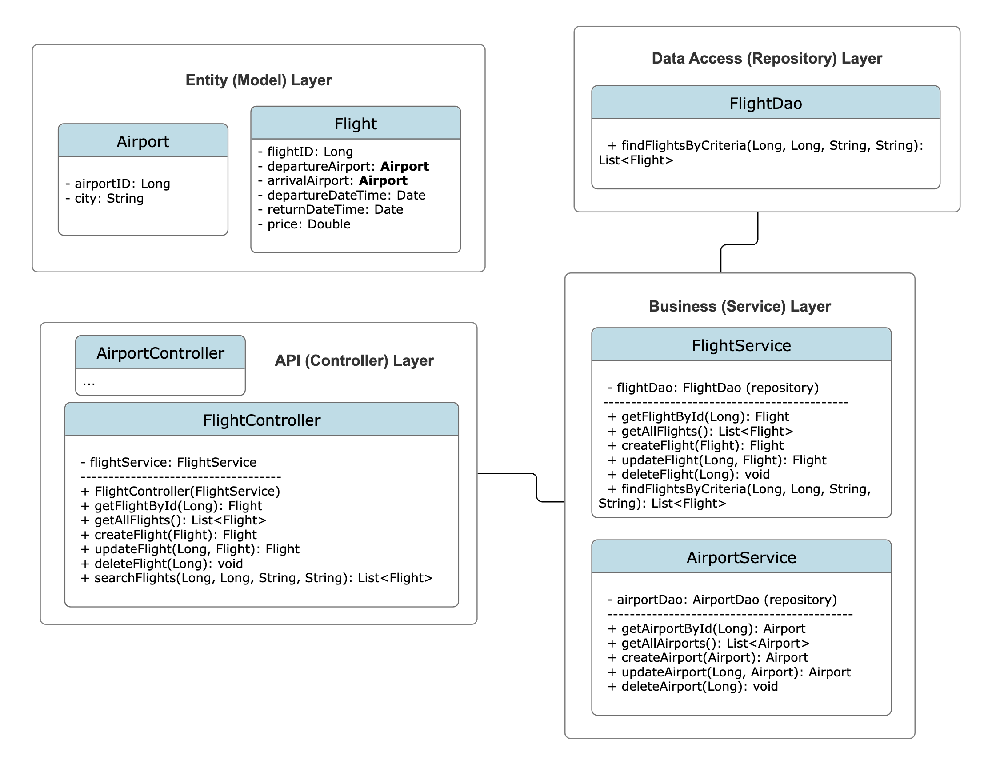

# Flight Search API

This project includes the development of a backend API for a flight search application. It manages flights effectively and provides users with the ability to search for flights.

## Used Technologies

- Java (Spring Boot)
- PostgreSQL
- Hibernate & JPA Repository
- OAuth2 (Github and Google login)
- Swagger UI (API documentation)
- Git

## UML Diagram



## Features and Technologies Used

- **Data Modeling:**
  - Data models for flights and airports were created using the "Code first" approach.


- **CRUD Structure:**
  - Basic CRUD (Create, Read, Update, Delete) operations were implemented for flights and airports.


- **Search API:**
  - An API endpoint was created to list flights based on the provided departure location, arrival location, departure date, and return date. It supports both one-way and round-trip flights.


- **REST Service:**
  - Services were exposed to the external world using the REST architecture, facilitating seamless inter-system integration.


- **Authentication:**
  - Implementation of OAuth2 for robust authentication and authorization.
  - Integration with GitHub and Google accounts for user login.
  - Provision for user registration with securely encrypted password storage.


- **Scheduled Background Jobs:**
  - A scheduled job was created to fetch flight information from a third-party API daily at a specific time and store it in the database (a mock API was developed and used).


- **Version Control:**
  - Efficient project management through the utilization of the Git version control system.


- **Documentation:**
  - Swagger used for API documentation, elucidating the API's usage.


- **Sustainability:**
  - Adhering to coding best practices for clean and sustainable code.


## Running the Project
- Use an IDE to run the project
  - IntelliJ IDEA etc.


- Open the terminal and navigate to the root of the project
  - Build the project:
  ```
    mvn clean install
  ```
  - Run the project:
  ```
    mvn spring-boot:run
  ```
